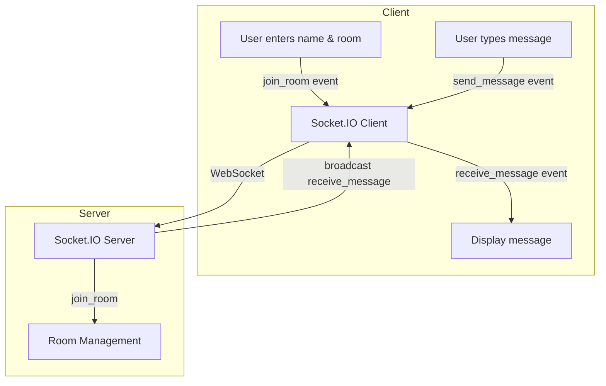

# Realtime Chat Application

A real-time chat application built with **React** (frontend) and **Socket.IO/Express** (backend). Instantly send and receive messages, create or join chat rooms, and enjoy a modern, responsive UI—perfect for group conversations or one-on-one chats, all in your browser.

---

## 📈 System Architecture & Data Flow

Below is a comprehensive workflow diagram illustrating how the frontend and backend interact, how users join rooms, how messages travel through the system, and how real-time updates are pushed to all connected clients.



**Explanation:**

- **User Entry:** The user provides a username and room name on the client UI. On joining, a `join_room` event is emitted to the backend.
- **Room Joining:** The server receives this event and assigns the user (socket) to the specified room, isolating conversations between different groups.
- **Messaging:** When a user types a message and hits send (or presses Enter), a `send_message` event is emitted with all relevant details (author, room, content, timestamp).
- **Broadcast:** The server captures this message and emits a `receive_message` event to all clients in the same room, ensuring only relevant users receive updates.
- **Display & Notification:** The client listens for new messages, updates the chat window in real time, and triggers an audio alert for new messages. The chat window automatically scrolls to the latest message.

---

## 🌟 Features

- **Real-Time Messaging:** Instantly send and receive messages using Socket.IO's low-latency WebSocket protocol.
- **Room-Based Communication:** Users can create or join named chat rooms, supporting both group and one-on-one conversations.
- **Responsive Modern UI:** Built with React, the interface adapts to desktop and mobile screens and provides an engaging user experience.
- **Audio Notifications:** Custom notification sounds play whenever a message is sent or received, enhancing responsiveness.
- **Auto-Scrolling Chat:** The chat window automatically scrolls down as new messages arrive, keeping the conversation in view.
- **Distinct Message Styling:** Your messages and those from others are styled differently for clarity and better readability.
- **Separation of Concerns:** The frontend and backend are decoupled, making it easy to swap, upgrade, or scale either side.

---

## 🏗️ Architecture Overview

- **Frontend (Client/):**  
  Powered by React, manages all user interactions, handles message input, connects to the backend via Socket.IO, and renders the chat interface with live updates.
- **Backend (Server/):**  
  Built with Express and Socket.IO, responsible for user connection management, room creation and joining, and relaying messages to appropriate rooms using efficient WebSocket communication.

---

## 📁 Directory Structure

```
realtime-chat/
├── Client/
│   ├── src/
│   │   ├── App.jsx           # Main React app, handles login and chat room join
│   │   ├── Chat.jsx          # Chat UI and message logic
│   │   ├── index.css         # Main styles
│   │   └── ...
│   ├── public/
│   ├── index.html
│   ├── package.json
│   └── ...
├── Server/
│   ├── server.js             # Express server with Socket.IO
│   ├── package.json
│   └── ...
```

---

## 🚀 Getting Started

### Prerequisites

- Node.js (v14+ recommended)
- npm or yarn

### 1. Clone the Repository

```sh
git clone https://github.com/sinha-19/realtime-chat.git
cd realtime-chat
```

### 2. Setup & Run Backend Server

```sh
cd Server
npm install
npm run start
# Server runs at http://localhost:1000
```

### 3. Setup & Run Frontend Client

```sh
cd ../Client
npm install
npm run dev
# Client runs at http://localhost:5173
```

### 4. Open in Browser

- Go to [http://localhost:5173](http://localhost:5173)
- Enter your username and a room name to start chatting!

---

## ⚙️ Customization

- **Server & Client Ports:**  
  Change ports in `Server/server.js` and in `Client/src/App.jsx` if needed.
- **Styling:**  
  Tweak `Client/src/index.css` for different themes and layouts.
- **Notifications:**  
  Swap out the audio files in `Client/src/` for custom notification sounds.

---

## 💡 Code Highlights

### Backend (Express + Socket.IO)

- Listens for `join_room`, `send_message`, and `disconnect` events from clients.
- Assigns sockets to rooms for isolated communication.
- Broadcasts messages only to users in the same room using `receive_message` events.

### Frontend (React)

- Maintains state for user, room, messages, and chat window.
- Auto-scrolls the chat view to always show the latest messages.
- Plays notification sounds on message send and receive.
- Applies different CSS classes for "your" vs. "others'" messages.

---

## 📝 Contributing

Contributions and suggestions are highly encouraged!  
For major changes, please open an issue to discuss your ideas before submitting a pull request.

---

## 📄 License

This project is licensed under the [MIT License](LICENSE).

---

## 👤 Credits

- Developed by [sinha-19](https://github.com/sinha-19)
- Powered by [React](https://react.dev/) and [Socket.IO](https://socket.io/)

---

**Happy chatting!**
